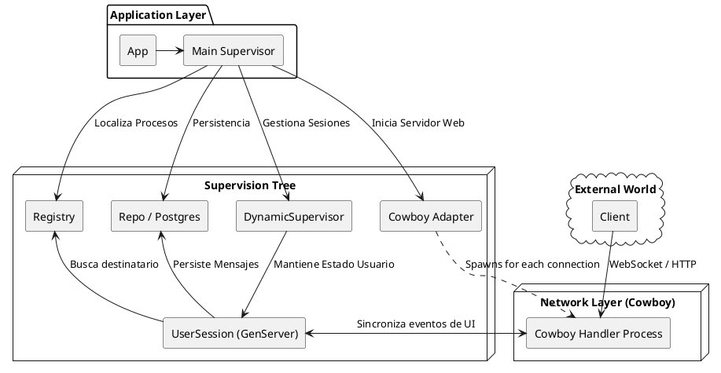

```plantuml
@startuml
skinparam componentStyle rectangle

package "Application Layer" {
    [App] -> [Main Supervisor]
}

node "Supervision Tree" {
    [Main Supervisor] ---> [Registry] : "Localiza Procesos"
    [Main Supervisor] ---> [Repo / Postgres] : "Persistencia"
    [Main Supervisor] ---> [DynamicSupervisor] : "Gestiona Sesiones"
    [Main Supervisor] ---> [Cowboy Adapter] : "Inicia Servidor Web"
    
    [DynamicSupervisor] --> [UserSession (GenServer)] : "Mantiene Estado Usuario"
}

node "Network Layer (Cowboy)" {
    [Cowboy Adapter] ..> [Cowboy Handler Process] : "Spawns for each connection"
}

cloud "External World" {
    [Client] --> [Cowboy Handler Process] : "WebSocket / HTTP"
}

' Flujos de comunicación
[Cowboy Handler Process] <-> [UserSession (GenServer)] : "Sincroniza eventos de UI"
[Repo / Postgres] <-- [UserSession (GenServer)]: "Persiste Mensajes"
[Registry] <-- [UserSession (GenServer)] : "Busca destinatario"

@enduml
```

## Testing 

Para el framework de testing recurrir a: https://claude.ai/share/0b369e7a-2fc3-4120-9889-eed0f0080ffe . Contiene ejemplos, descripciones y links a documentacion dentro de sus guias.