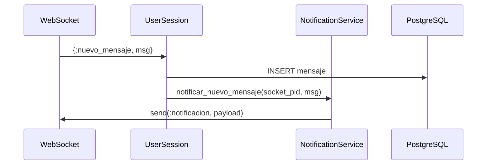

# Plan de Implementación Asistido con IA: Sistema de Notificaciones
Resultado de chat sobre como encarar esta implementacion compleja y acoplada en varias partes del programa en la version 0.3
## 📋 Análisis del Estado Actual

### Arquitectura Existente
Tu sistema actualmente tiene:
- ✅ WebSocket handlers funcionando
- ✅ Sesiones de usuario con `Runtime.Session`
- ✅ Salas grupales (`Runtime.Room`) y privadas (`Runtime.PrivateRoom`)
- ✅ Persistencia con Ecto
- ✅ Registry para localización de procesos
- ⚠️ **Problema**: Lógica de notificaciones acoplada en múltiples lugares

### Deuda Técnica Identificada
1. **Acoplamiento**: Los GenServers envían mensajes directamente al `socket_pid`
2. **Duplicación**: Lógica similar de notificación en `Room`, `PrivateRoom` y `Session`
3. **Falta de abstracción**: No hay un servicio centralizado para manejar el estado de lectura/entrega

---

## 🎯 Plan de Migración: NotificationService

### Fase 1: Crear el Servicio de Notificaciones (1 Programador - 3 días)

#### Paso 1.1: Estructura del Módulo NotificationService

  @spec notificar_nuevo_mensaje(pid(), map()) :: :ok | {:error, term()}
  def notificar_nuevo_mensaje(socket_pid, mensaje) do

  @spec notificar_mensaje_leido(pid(), integer(), DateTime.t()) :: :ok | {:error, term()}
  def notificar_mensaje_leido(socket_pid, mensaje_id, leido_en) do

  @spec enviar_bandeja(pid(), list(map())) :: :ok | {:error, term()}
  def enviar_bandeja(socket_pid, mensajes_no_leidos) do

  @spec notificar_operacion(pid(), :exito | :error, String.t()) :: :ok
  def notificar_operacion(socket_pid, tipo, mensaje) do

  defp enviar_a_socket(socket_pid, payload) when is_pid(socket_pid) do
  defp enviar_a_socket(_socket_pid, _payload) do

  @spec marcar_entregado(integer()) :: :ok | {:error, term()}
  def marcar_entregado(mensaje_id) do

  @spec marcar_leido(integer()) :: {:ok, DateTime.t()} | {:error, term()}
  def marcar_leido(mensaje_id) do

  @spec obtener_mensajes_no_leidos(integer()) :: list(map())
  def obtener_mensajes_no_leidos(usuario_id) do

#### Paso 1.2: Actualizar el WebSocketHandler

  def websocket_info({:notificacion, payload}, state) do
    Logger.debug("[WS] Recibiendo notificación: #{inspect(payload.tipo)}")
        {:ok, state}

  def websocket_info({:nuevo_mensaje, mensaje}, state) do
    Logger.warning("[WS] Usando formato antiguo de mensaje - migrar a NotificationService")
    {:ok, state}

#### Paso 1.3: Migrar Runtime.PrivateRoom --------------

  @impl true
  def handle_call({:agregar_mensaje, de, contenido}, _from, state) do
    nuevo_msg = %{emisor: de, contenido: contenido, estado: "ENVIADO", fecha: DateTime.utc_now()}
    para = Enum.find(state.usuarios, fn usuario -> usuario != de end)

    case Tpg.Mensajes.MultiInsert.enviar_mensaje(para, de, nuevo_msg) do
      {:ok, mensagem} ->
        Logger.info("[ROOM-PRIVATE] Mensaje guardado: #{nuevo_msg.contenido}")
        new_state = %{state | mensajes: [nuevo_msg | state.mensajes]}
        
      Tpg.Services.NotificationService.notificar_nuevo_mensaje(
          mensagem.socket_pid,
          Map.put(mensagem, :tipo, :privado)
      )

        {:reply, {:ok, novo_msg}, new_state}

      {:error, motivo} ->
        Logger.alert("[ROOM-PRIVATE] Mensaje perdido: #{inspect(motivo)}")
        {:reply, {:error, motivo}, state}

---

## 🚀 Paralelización: 3 Programadores Trabajando Simultáneamente

### **Programador 1 (Lead)**: NotificationService + Migración Core
**Duración**: 5 días  
**Tareas**:
1. Crear `NotificationService` (Día 1-2)
2. Migrar `WebSocketHandler` (Día 2)
3. Migrar `PrivateRoom` (Día 3)
4. Migrar `Room` (Día 4)
5. Testing de integración (Día 5)

**Entregables**:
- ✅ Módulo `NotificationService` funcional
- ✅ 100% de las notificaciones usando el nuevo sistema
- ✅ Tests unitarios del servicio

---

### **Programador 2**: Feature V0.6 - Estados de Mensajes (Entregado/Leído)
**Tareas**:
1. **Paso 1-2**: Implementar lógica de "mensaje leído" en conversaciones privadas
   ```elixir
   # Agregar endpoint en WebSocketHandler
   def websocket_handle({:text, json}, state) do
     case Jason.decode(json) do
       {:ok, %{"accion" => "marcar_leido", "mensaje_id" => msg_id}} ->
         manejar_marcar_leido(msg_id, state)
     end
   end

   defp manejar_marcar_leido(mensaje_id, state) do
     case Tpg.Services.NotificationService.marcar_leido(mensaje_id) do
       {:ok, timestamp} ->
         # Notificar al emisor que su mensaje fue leído
         # (requiere localizar al emisor vía Registry)
         respuesta = Jason.encode!(%{
           tipo: "confirmacion",
           mensaje: "Mensaje marcado como leído"
         })
         {:reply, {:text, respuesta}, state}
       
       {:error, motivo} ->
         # Manejar error...
     end
   end
   ```

2. **Paso 3**: Extender a grupos (broadcast de "leído" a todos los miembros)
3. **Paso 4**: Frontend - Indicadores visuales de "✓" (enviado), "✓✓" (entregado), "✓✓" azul (leído)

**Entregables**:
- ✅ Estados de mensaje funcionando 1-a-1
- ✅ Estados de mensaje en grupos
- ✅ UI actualizada

---

### **Programador 3**: Feature V0.7 - Bandeja de Entrada y Notificaciones Push
**Tareas**:
1. **Paso 1-2**: Endpoint para obtener mensajes no leídos
   ```elixir
   # En WebSocketHandler
   {:ok, %{"accion" => "obtener_bandeja"}} ->
     mensajes = NotificationService.obtener_mensajes_no_leidos(state.id)
     NotificationService.enviar_bandeja(self(), mensajes)
     {:ok, state}
   ```

2. **Paso 3**: Sistema de badges (contador de mensajes no leídos por conversación)
   ```elixir
   # Agregar a NotificationService
   def obtener_contadores_no_leidos(usuario_id) do
     # Query agrupada por receptor_id
     # Retorna: %{chat_id => count}
   end
   ```

3. **Paso 4**: Notificaciones de presencia ("Usuario X está escribiendo...")
   ```elixir
   # WebSocketHandler
   {:ok, %{"accion" => "escribiendo", "chat_id" => chat_id}} ->
     # Broadcast a otros miembros del chat
   ```

4. **Paso 5**: Testing + Pulir UX

**Entregables**:
- ✅ Bandeja de entrada funcional
- ✅ Badges de contadores
- ✅ Indicador "escribiendo..."

---

## 📊 Cronograma Integrado

| Día | Prog 1 (A) | Prog 2 (B) | Prog 3 (C) |
|-----|---------------|------------------|------------------|
| 1   | `NotificationService` base | Setup + Diseño DB | Endpoint bandeja |
| 2   | Migrar WS Handler | Lógica privado | Query no leídos |
| 3   | Migrar PrivateRoom | Lógica grupos | Contadores |
| 4   | Migrar Room | Frontend estados | Presencia |
| 5   | Tests integración | Tests + Review | Tests + UX |

---

## 🔄 Proceso de Integración

### Pull Requests
1. **Prog 1** crea branch `feature/notification-service`
2. **Prog 2** crea branch `feature/message-states` (depende de Prog 1 Paso 2)
3. **Prog 3** crea branch `feature/inbox-notifications` (independiente)

### Merge Strategy
```
Día 2: Merge Prog 1 → main (NotificationService disponible)
Día 3: Prog 2 puede integrar con Prog 1
Día 5: Merge Prog 2 y Prog 3 → main (feature completa)
```

---

## 🧪 Testing Checklist

### Tests de Integración (Prog 1 + Prog 2)
```bash
# Flujo completo:
# 1. Usuario A envía mensaje a B
# 2. B recibe notificación
# 3. B marca como leído
# 4. A recibe confirmación de lectura
```

---

## ✅ Criterios de Aceptación

### NotificationService (Prog 1)
- [ ] Todas las notificaciones usan `NotificationService`
- [ ] Cero llamadas directas a `send(socket_pid, ...)`

### Estados de Mensaje (Prog 2)
- [ ] Mensajes privados muestran estados correctamente
- [ ] Mensajes grupales muestran estados
- [ ] Frontend sincronizado con backend

### Bandeja de Entrada (Prog 3)
- [ ] Contador de no leídos preciso
- [ ] Indicador "escribiendo..." funcional
- [ ] Performance < 100ms para obtener bandeja

---

## 🚨 Riesgos y Mitigaciones

| Riesgo | Probabilidad | Mitigación |
|--------|--------------|------------|
| Conflictos en `WebSocketHandler` | Media | Prog 1 trabaja primero, otros esperan merge |
| Regresión en notificaciones | Alta | Mantener código legacy 2 sprints |
| Performance DB con queries grandes | Media | Agregar índices en `estado` y `receptor_id` |

---

## 📚 Documentación Adicional

### Diagramas de Secuencia

